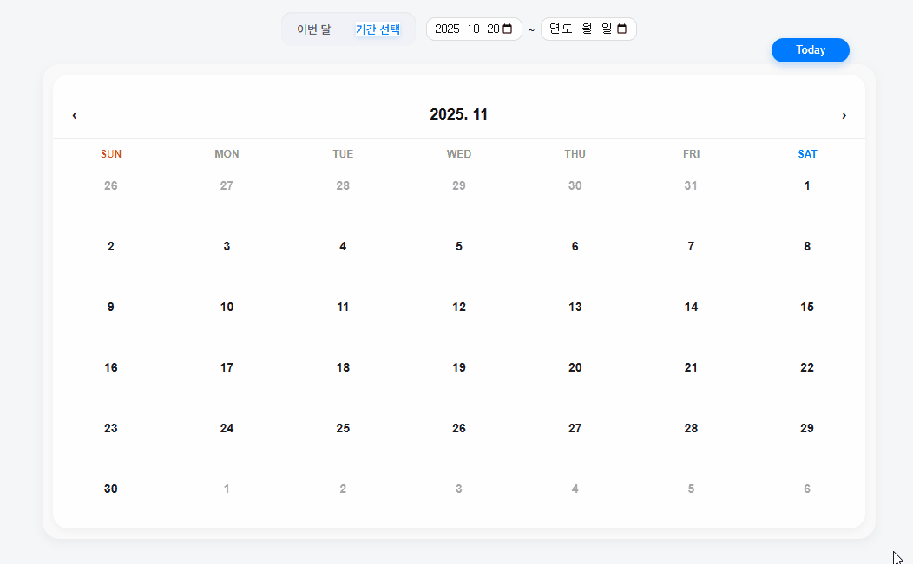
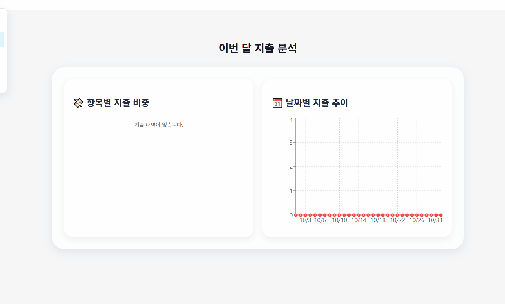
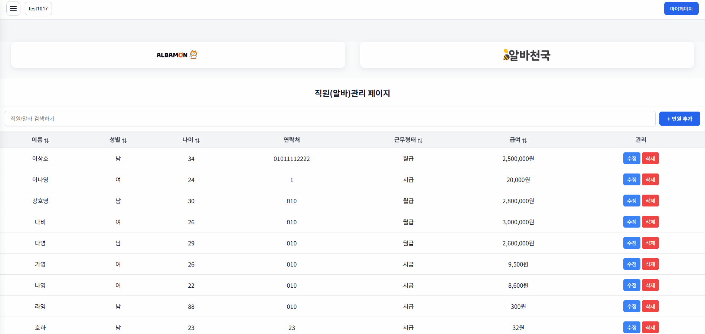
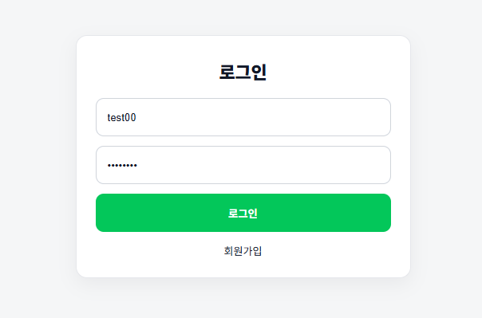
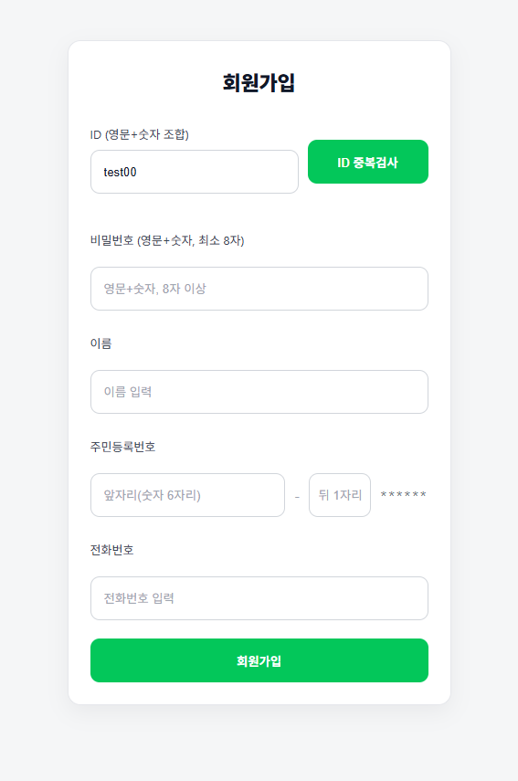
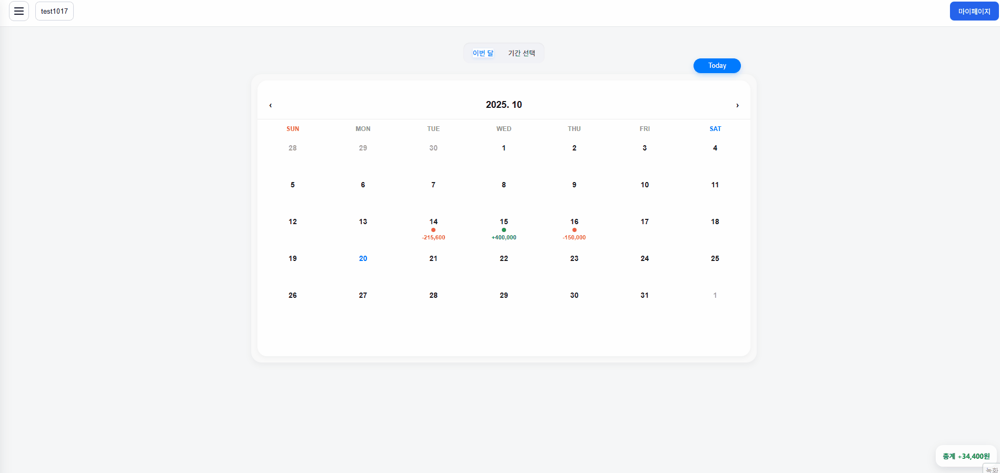
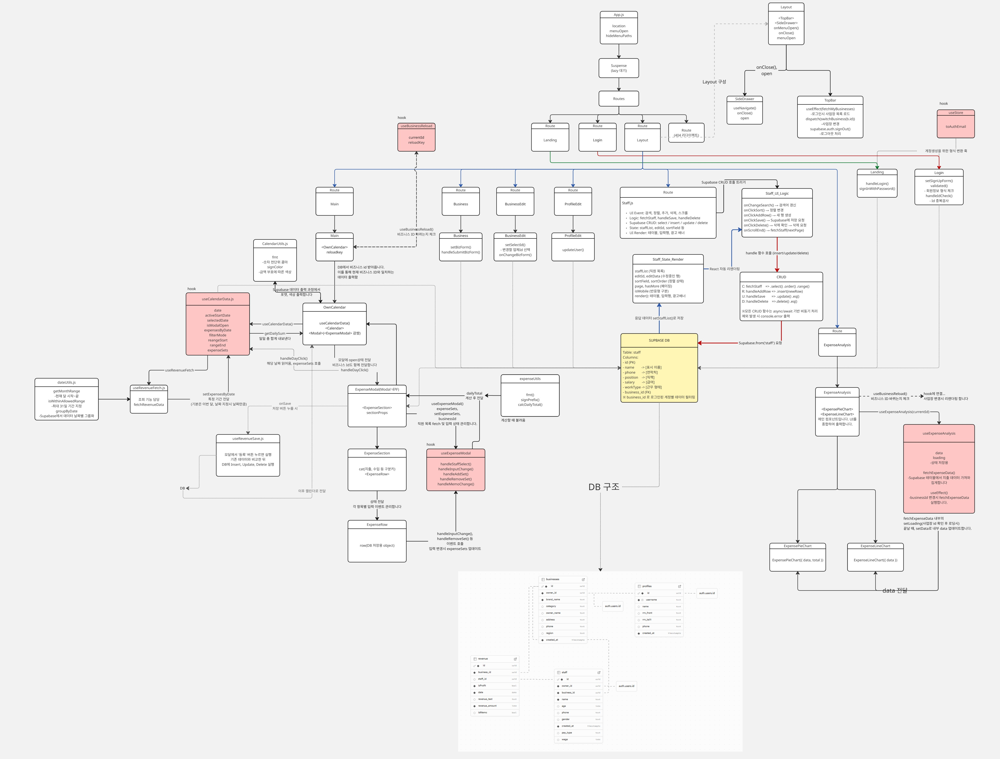
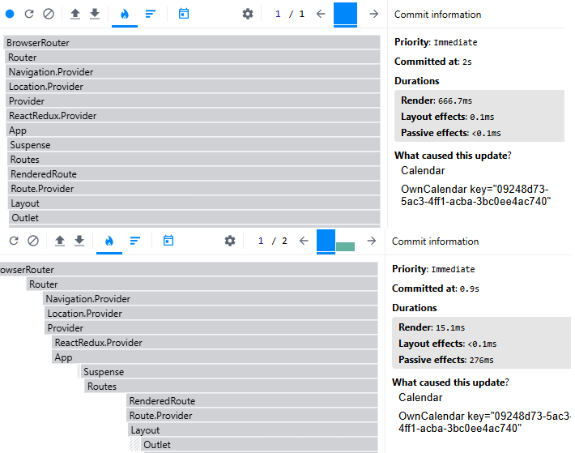

# UI

 가계부 파트.
 기간 선택 필터링을 지원합니다.
 입력된 정보는 Supabase의 금전 table에 들어갑니다.
 중복되는 데이터는 다시 저장되지 않습니다.

 
 지출 분석 페이지.
 이번 달의 지출을 입력된 분류에 따라 분석해줍니다.

 직원 관리 페이지.
 가상 스크롤이 적용되어 있습니다.
 등록, 수정, 삭제와 같은 CRUD를 지원하며
 직원 검색과 함께 sorting 기능을 제공합니다.

 
 로그인 페이지.
 이미 가입된 계정이 있다면 로그인 할 수 있고,
 가입된 계정이 없다면 회원가입 할 수 있습니다.

 회원가입 페이지.
 입력된 정보는 Supabase의 회원 table에 들어갑니다.

 개인정보 수정, 업체 수정, 업장 변경
 
 
 

# flow

# 기획의도
현재 많은 개인 자영업자, 특히 술집·음식점·카페 등에서는 일일 매출 및 지출 내역을 여전히 수기로 기록하거나, Excel sheet에 수동 입력하고 있다. 이는 시간 소모가 크고, 월 별 정산이나 인건비 계산 시 누락 오류 및 위험성이 커 비효율적인 방식이다. 또한, 기존 회계 app은 회계 지식이 필요한 경우가 많아 직관성이 떨어진다.  예를 들어, [그랜터](https://granter.biz/ai-automation)에서도 비슷한 서비스를 제공하고 있지만, 달력 형태의 대시보드가 아닌 개별 자산과 연결되어 있는 형태의 대시보드이다. 이용자들에게 익숙한 **달력**이나 **가계부** 형식의 대시보드를 활용해 **회계 지식이 없는 초보 자영업자들에게도 친근하게 다가갈 수 있는**, 간단하면서도 직관적인 **'웹 기반 매출 관리 서비스'** 를 기획하게 되었다.

## 기대 효과
복잡한 회계 지식 없이 달력을 클릭하면 매출과 지출을 바로 기록하고, 분석할 수 있도록 설계하였다.
더 나아가 순이익 자동계산 및 월별 합산 시각화로 뻗어 나간다면 자영업자들의 편의성 증대도 가능할 것이다.

 
 
 

# 팀원 소개
| 한정연 | 조준환 | 강진수 |
|:------:|:------:|:------:|
|  |  |  |
| Main, chart 페이지 제작. Calendar, Modal, Layout components 제작. | Login, Landing, Business 페이지 제작. Supabase 테이블 관리 | Staff 페이지 제작. 가상 스크롤 적용. 전체 아이디어 및 정보 검수. |
| [GitHub](https://github.com/DOT-SOY) | [GitHub](https://github.com/junhwan0427) | [GitHub](https://github.com/shanekang1) |

 

[노션 Link](https://www.notion.so/28dbd6e06207818a9f0fcce568ff6c72?source=copy_link)
 
 
 

# 개발 환경

  

 
 
 

# 구현할 핵심 기능
본 프로젝트에서 구현할 핵심 기능은 다음과 같다.

### CRUD
메인 페이지에서 달력을 눌러 가계부를 등록하고, 읽어오고, 수정하거나 지울 수 있도록 한다.
직원 관리 페이지에서 직원을 추가하고, 읽어오고, 수정하거나 지울 수 있도록 한다.

### SPA(router)
React Router를 이용해 Single Page Application 구조로 제작한다.

 
주요 라우트는 다음과 같다:

1. / : 메인(달력) 페이지
2. /business : 사업장 등록 페이지
3. /staff : 직원 관리 페이지
4. /profile : 프로필 관리 페이지

 
라우팅 시 전체 새로고침 없이 페이지 일부만 전환되어 부드러운 UX를 제공한다.

### 가상 스크롤
많은 데이터를 렌더링 해야 하는 페이지(예: 직원 관리 페이지) 에는 가상 스크롤를 적용하여 렌더링 성능을 향상하고, 메모리를 절약한다.

### 코드 스플리팅
모든 페이지 컴포넌트를 한 번에 로드하지 않고, 라우트 단위로 지연 로딩(lazy loading) 처리한다. 
React의 lazy()와 Suspense를 활용하여 초기 번들 크기를 최소화하고, 페이지 로딩 속도를 개선한다.

### API 연동
Supabase를 백엔드 서비스로 사용하며, 인증(Auth), 데이터베이스(PostgreSQL), 스토리지(Storage)를 모두 Supabase API를 통해 연동한다. 
프로젝트에서는 다음과 같은 테이블과 연동된다:
1. revenue — 가계부 데이터 (날짜, 항목, 금액, 메모 등)
2. staff — 직원 데이터 (이름, 연락처, 급여 등)
3. business — 사업장 정보

 API 통신은 **lib/supabase.js**에 설정된 클라이언트를 통해 수행된다.

### 반응형 웹
CSS Grid, Flexbox, @media 쿼리를 활용해 데스크톱, 태블릿, 모바일 환경에서도 최적의 UI를 제공한다.

 
 
 
